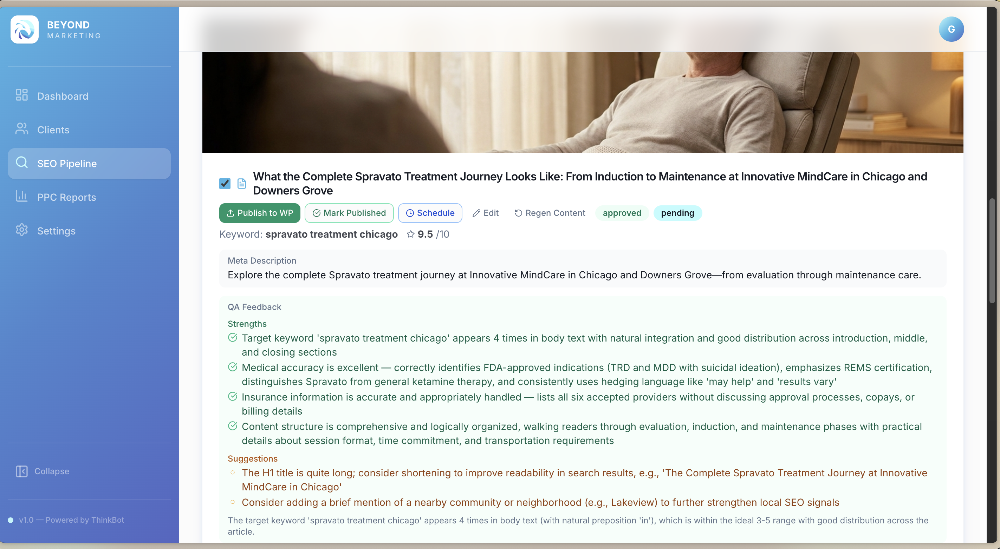

[README Beyond AI.md](https://github.com/user-attachments/files/29231910/README.Beyond.AI.md)
# Beyond AI — Agentic SEO Operations Platform

<p align="center">
  
</p>

<p align="center">
  <strong>Internal AI platform that runs Beyond Marketing's full SEO content operations</strong><br/>
  Keyword research → AI content generation → QA scoring → direct publishing to WordPress & Google Business Profile.<br/>
  One person. One platform. Content planned months in advance.
</p>

---

## About This Repository

This is a portfolio showcase of Beyond AI, an internal platform I conceived, architected, led into production, and now maintain at Beyond Marketing. The production codebase is private under the company's organization.

This repository documents the product architecture, feature design, AI experience, and operational impact behind the platform.

---

## My Role — Product Architect, AI Experience Lead & Platform Owner

**Gaby Estrella**  
[LinkedIn](https://www.linkedin.com/in/gaby-estrella-/) · [GitHub](https://github.com/gabyestrella) · [gabyestrella.dev](https://gabyestrella.dev)

This platform exists because I saw a problem that couldn't be solved with a workflow tool alone.

It started as an n8n automation concept. But as I mapped out the full scope — the number of clients, the complexity of per-client customization, the QA requirements for healthcare content, the direct publishing integrations — it became clear that what we actually needed was a dedicated internal platform. I made the case for that shift, helped lead the hiring process to find the right developer, and defined the entire product: every feature, every filter, every rule, every integration.

Once the platform was built and functional, I led QA — catching a significant number of bugs across the full flow before we went live. When the developer engagement ended, I took full ownership. Today I maintain the platform, implement new features and configurations, and manage all content operations through it — using Claude Code for every iteration and improvement.

**What I owned end-to-end:**
- Identified the need and defined the full product vision
- Architected the SEO pipeline from scratch
- Defined every feature, filter, and client configuration requirement
- Participated in developer interviews and selected the right person for the build
- Led QA and bug detection before launch
- Took over platform maintenance after developer handoff
- Continue to build new features and improvements using Claude Code

---

## Why This Exists

Before Beyond AI, content for our mental health clinic clients was produced by a team of five or more people working under constant time pressure — blogs being written in the same month they needed to publish, the same instructions given over and over, and the same errors appearing over and over despite that.

Healthcare content has no margin for error. A blog for a Spravato clinic can't misrepresent FDA indications. A TMS post can't make claims we can't back up. A wound care article has to speak to a Medicare-eligible audience, not a general one. Getting this right required supervision, repeated corrections, and significant coordination.

I wanted a system where the intelligence was built in from the start — where client-specific rules, vertical-specific content standards, and QA were part of the pipeline, not an afterthought.

Beyond AI replaced a five-person manual process with a single person managing an automated pipeline. Content is now ready months in advance, every piece meets the same quality standard, and publishing happens in one click — directly to WordPress and Google Business Profile — without ever logging into a client account.

---

## The Impact

- **5+ people → 1.** Content operations that required a full team now run through a single platform managed by one person.
- **Content planned months ahead.** Instead of racing to publish in the same month content is written, we now have a pipeline that runs ahead of schedule.
- **Consistent quality across every client.** Every blog passes the same AI QA scoring threshold. Anything below 7.0 is automatically regenerated — no human inconsistency.
- **One-click publishing to WordPress and Google Business Profile.** Connecting the platform directly to client WordPress instances and GMB profiles was one of the hardest technical challenges we solved. Now a strategist clicks once and the content goes live — no logging into individual accounts, no copy-pasting, no manual scheduling.
- **Healthcare compliance built in.** Content rules by vertical are embedded into the AI prompt system. The platform doesn't generate content that violates what we can or can't say for each service line.

---

## How the Platform Works

### Client Setup

Every new client gets a dedicated configuration profile before any content is generated. This includes:

- Services offered and how they should be described
- Brand voice and tone preferences
- What the AI is and isn't allowed to say (compliance rules per vertical)
- WordPress credentials and Google Business Profile connection
- Manual approval settings (some clients require human review before publishing)

This setup is what makes the content feel custom — not like it came from a template. The AI reads these settings before generating anything.

### SEO Pipeline

```
Monday.com trigger (item moved to "Ready")
        │
        ▼
Keyword Research
SEMrush primary keywords → Perplexity competitor research → Claude synthesis
Results exported to Google Doc
        │
        ▼
Content Generation
2 blog posts (1,200–1,500 words) + 2 Google Business Profile posts (200–300 words)
Generated from versioned prompt templates with client rules applied
        │
        ▼
Image Generation
Gemini (primary) → Replicate Flux Pro (fallback) → fal.ai (fallback)
        │
        ▼
AI Quality Assurance
Claude scores each deliverable 0–10
Below 7.0 → auto-regenerate (max 2 loops)
Still below threshold → paused for manual review
        │
        ▼
Publishing
WordPress (draft or live based on client approval setting)
Google Business Profile (with CTA)
        │
        ▼
Google Drive Archival
All HTML + images archived to client folder
```

---

## Key Features

| Feature | Description |
|---|---|
| **Per-client configuration** | Each client has a dedicated profile with brand voice, service rules, compliance notes, and publishing credentials |
| **Vertical-specific AI rules** | Content rules per specialty (TMS, Spravato, ketamine, wound care, Medicare) embedded into every prompt |
| **Versioned prompt templates** | All AI prompts are editable from the Settings UI with automatic version tracking |
| **AI QA scoring** | Claude scores every deliverable before it's approved. Below 7.0 triggers automatic regeneration |
| **Direct WordPress publishing** | One-click publish or schedule to client WordPress instances — no manual login required |
| **Direct GMB publishing** | Posts go directly to Google Business Profile with CTAs from the platform |
| **Scheduled publishing** | Approve content now, schedule it to go live at the right time — 15-minute granularity |
| **Live pipeline UI** | Real-time view of every step as the pipeline runs, with logs, QA scores, and error details |
| **Google Drive archival** | Every piece of content archived automatically to the client's Drive folder |

---

## Content Quality System

Healthcare content requires a level of precision that generic AI output doesn't meet by default. I designed the QA layer specifically for this:

- **Medical accuracy checks** — Claude verifies that FDA-approved indications, REMS certification requirements, and hedging language standards are met
- **Compliance language** — Insurance information, clinical claims, and treatment descriptions follow vertical-specific rules I defined
- **Keyword integration** — Target keyword appears in the right frequency and distribution across the piece
- **Structural review** — Title length, meta description, section organization, and local SEO signals are all evaluated

A piece that scores below 7.0 doesn't go to review — it gets regenerated. Only content that passes gets handed to the strategist for final approval.

---

## Tech Stack

| Layer | Technology |
|---|---|
| Framework | Next.js 14 (App Router) + TypeScript |
| Database | PostgreSQL 16 + Drizzle ORM |
| AI | Anthropic Claude (Opus 4.6 / Sonnet 4.6) |
| Keyword Research | SEMrush + DataForSEO fallback |
| Competitor Research | Perplexity (sonar-pro) |
| Image Generation | Gemini → Replicate (Flux Pro) → fal.ai |
| Publishing | WordPress REST API + Google Business Profile API |
| Drive & Docs | Google Drive API + Google Docs API |
| Scheduler | node-cron (in-process) |
| Deployment | Railway |
| Auth | NextAuth v5 |

---

## Integrations

**WordPress** — The platform connects directly to each client's WordPress instance via REST API. Content is published as draft or live depending on the client's approval setting. No manual login. No copy-paste.

**Google Business Profile** — Posts go directly to the client's GMB profile with CTAs. Establishing this connection was one of the harder technical challenges in the project — and one of the highest-impact features once it worked.

**Google Drive** — All SEO content is archived automatically to the client's Drive folder after publishing.

**Monday.com** — The pipeline is triggered by Monday.com workflow events, keeping content operations connected to the team's existing project management flow.

---

<p align="center">
  Five people. Constant pressure. The same errors, month after month.<br/>
  Now it's one platform, one person, and content ready months in advance.<br/><br/>
  <strong>That's what happens when marketing experience and AI engineering work together.</strong>
</p>
